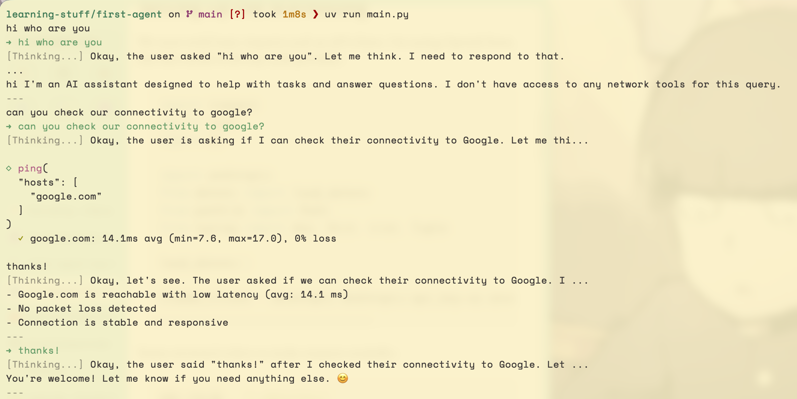

# First Agent

A simple AI agent that uses local Ollama models. From [Simon Willison](https://simonwillison.net/2025/Sep/18/agents/): **An LLM agent runs tools in a loop to achieve a goal**.

Followed [Thomas Ptacek's blog post](https://fly.io/blog/everyone-write-an-agent/) and adapted to use Ollama instead.

## Demo (screenshot)



## Quick Start

### 1. Install Ollama

```bash
brew install ollama

# Or using the official installer
curl -fsSL https://ollama.com/install.sh | sh
```

### 2. Start Ollama

```bash
# In a separate terminal, start Ollama
ollama serve
```

### 3. Pull a Model

Choose a model based on your machine and needs:

```bash
ollama pull qwen2.5:3b
```

### 4. Install Dependencies

```bash
# Sync dependencies
uv sync
```

### 5. Run the Agent

```bash
# Run the interactive agent
uv run python main.py
```

## Development

```bash
# Format code
uv run ruff check .
uv run ruff format .

# Type checking
uv run mypy main.py
```

### Install development dependencies:

```bash
uv add --group dev pytest pytest-cov ruff mypy
```

## License

MIT License
